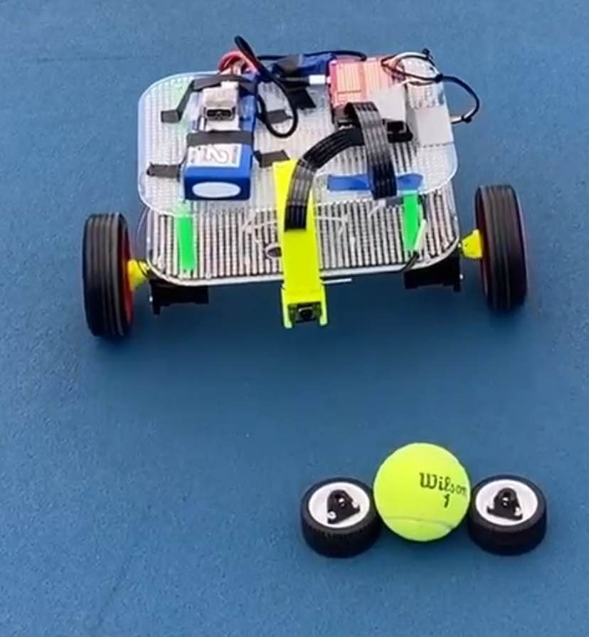

# RoboRetriever
Monash University ECE4191 capstone design project to create an autonomous tennis ball collecting robot

## Directory reference
```bash
├── docs # Contains installation and setup instructions
├── img # Contains test and misc images
├── milestone1 # Contains source code for on and off robot compute
├── models # Contains YOLO .pt files
├── research # Research code for experimenting and testing
```

<div style="text-align: center;">
    
</div>